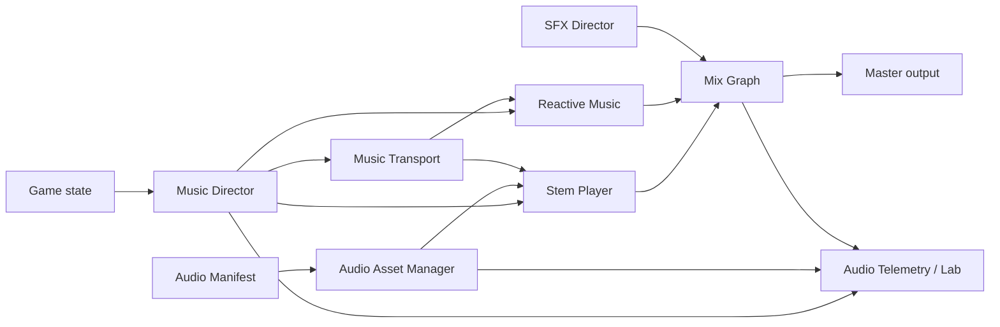

# THE LAST LANCE Professional Audio System Design

**Status:** Approved design  
**Date:** 2026-06-13  
**Owner:** THE LAST LANCE team  
**Purpose:** Define the creative, production, runtime, mix, accessibility, and quality contract for a professional-grade soundtrack and game-audio system.

---

## 1. Executive Summary

THE LAST LANCE already has an unusually responsive procedural score: combat events, combo tiers, bosses, and COHERENCE can influence the music in real time. Its limitation is not responsiveness. Its limitation is that the procedural score currently carries too much of the musical burden. The two existing tracks share a short structural spine, drops gain more brightness than emotional or physical scale, boss identities are motifs over a shared foundation, and the overall palette is too narrow for multi-hour play.

The approved direction is a **hybrid authored-stem and procedural-reactive system**:

- Professionally composed and produced stems provide memorable songs, groove, emotional development, and sonic finish.
- Horizontal resequencing changes musical sections for biomes, bosses, narrative events, victory, death, and THE CHOICE.
- Vertical layering responds to combat intensity, Heat, COHERENCE, and boss phases.
- The existing procedural system becomes a reactive instrument for perfect-dash responses, combo punctuation, transition masking, COHERENCE coloration, and resilient fallback playback.
- A complete sound-design pass gives every important verb, enemy, boss, reward, and UI event a recognizable sonic identity.

The creative north star is:

> **Neon elegy turned lethal dancefloor.**

The score must carry an arc from **grief**, through **focused flow**, into **transcendence**. It must be memorable enough to exist as an OST and adaptive enough to feel inseparable from play.

---

## 2. Goals

### 2.1 Player Experience Goals

1. Make combat feel rhythmically compelling without forcing rhythm-game play.
2. Give players recognizable musical hooks they can remember after a session.
3. Make biome changes, boss phases, Overdrive, Last Breath, victory, and THE CHOICE feel musically consequential.
4. Sustain repeated sessions without obvious short-loop fatigue.
5. Improve gameplay clarity through distinct, prioritized audio cues.
6. Preserve the meaning of the COHERENCE system by binding sight, sound, and player performance.
7. Deliver a soundtrack that is commercially credible as a standalone OST.

### 2.2 Product Goals

1. Establish a signature audio identity that differentiates THE LAST LANCE from generic synthwave and darksynth games.
2. Produce marketable soundtrack material for trailers, social clips, streaming, and an OST release.
3. Provide a scalable production framework for future modes, bosses, and content updates.
4. Keep browser loading, memory use, and runtime performance within explicit budgets.

### 2.3 Success Definition

The audio upgrade succeeds when players describe the soundtrack as memorable and inseparable from the game, can distinguish major bosses by sound, perceive gameplay escalation without looking at meters, and can play for at least 30 minutes without audio fatigue.

---

## 3. Non-Goals

- THE LAST LANCE will not become a mandatory rhythm game.
- The soundtrack will not react to every individual event; excessive reactivity becomes chaotic and musically incoherent.
- Full authored stems will not be pitch-shifted or playback-rate shifted during normal gameplay.
- Loudness will not be used as a substitute for impact.
- The system will not require a large third-party middleware runtime.
- Audio will never be the only carrier of essential gameplay information.
- Launch does not require every future mode or content update to receive bespoke music.

---

## 4. Current-State Assessment

### 4.1 Strengths to Preserve

- A sample-aware Web Audio transport and procedural music engine already exist.
- Combat, combo, boss, and COHERENCE state can already influence audio.
- The audio graph includes useful buses, compression, soft clipping, delay, and reverb.
- The game has strong narrative and systemic anchors for musical transformation.
- Procedural playback can serve as a robust fallback when authored assets are unavailable.

### 4.2 Gaps to Resolve

- The launch score currently has only two primary tracks.
- The principal song form is approximately two minutes and repeats too visibly.
- Existing drops change brightness more than perceived size, groove, or emotional intensity.
- Boss themes are short motifs over a largely shared backing rather than complete musical identities.
- Biome evolution is not meaningfully represented in the score.
- Perfect-dash feedback is too small for a signature mechanic.
- The current synthesized drum and impact palette lacks the weight, detail, and variation expected from a professional action game.
- The current bounces are narrow, low-mid weighted, and offer limited long-session contrast.

---

## 5. Creative Direction

### 5.1 Sonic Identity

The score lives between:

- Grieving neon ambience
- Physical, syncopated electronic grooves
- Distorted ceremonial percussion
- Human or human-like vocal textures
- Luminous harmonic release
- Sharp, synthetic combat punctuation

The target is not nostalgic synthwave. The target is a future-ruin ritual with a dancefloor pulse.

### 5.2 Emotional Arc

| State | Emotional Function | Musical Behavior |
|---|---|---|
| Low COHERENCE | Isolation, grief, uncertainty | Sparse harmony, narrow image, distant motif fragments, reduced high-frequency detail |
| Building flow | Resolve and forward motion | Stronger groove, clearer bass, motif fragments joining into phrases |
| High COHERENCE | Focus and communion | Wider image, richer harmony, choir or luminous texture, confident hook presentation |
| Overdrive | Controlled transcendence | Immediate signature, rhythmic release, full-spectrum payoff, short-term density increase |
| Last Breath | Time suspended, refusal to fall | Sudden thinning, heartbeat or breath-scale pulse, exposed Lance motif |
| Victory | Earned release | Complete or transformed Lance motif, harmonic resolution without triumphal cliché |
| THE CHOICE | Moral weight | Reduced pulse, exposed human texture, space for the decision |

### 5.3 THE LANCE THEME

THE LANCE THEME is the score's primary mnemonic identity. It must:

- Be recognizable when played by lead synth, bass, choir, percussion rhythm, or sparse ambience.
- Survive reharmonization and tempo-neutral presentation.
- Appear in every arena suite and major narrative cue.
- Be used selectively enough to retain meaning.
- Reach its clearest, most complete form only at major moments.

Each arena and boss suite also requires unique secondary material so the Lance motif does not flatten the entire soundtrack into one song.

### 5.4 Groove Standard

Groove is a first-class design requirement. The score should use controlled syncopation, strong internal pulse, and readable rhythmic hierarchy. Intermediate syncopation is preferred over constant complexity: the player should want to move with the music without having to consciously count it.

### 5.5 Dynamic Contrast

Impact depends on contrast. The score must regularly thin, breathe, and withhold layers so that hooks, drops, and combat climaxes can genuinely arrive. Silence and near-silence are valid musical tools.

---

## 6. Music Content Specification

### 6.1 Launch Content Target

| Content | Quantity | Authored Source Duration | Required Variants |
|---|---:|---:|---|
| Arena suites | 3 | 3-4 minutes each | Multiple segments, intensity layers, COHERENCE coloration |
| Biome palettes | 6 | Overlay/replacement material | Distinct instrumentation and ambience per biome |
| Boss suites | 6 | 90-150 seconds each | Arrival, three phase arrangements, defeat or resolution |
| Hub/stillpoint | 1 suite | 2-3 minutes | Low-activity variation |
| Death/debrief | 1 family | 30-90 seconds | Performance-sensitive endings |
| Victory | 1 cue family | 45-90 seconds | Standard and final-victory variants |
| THE CHOICE | 1 bespoke sequence | Event-length | Decision space and both outcomes |

The launch target is **30-40 minutes of linear OST source material** that produces at least **90 minutes of perceived variation** before obvious repetition fatigue.

### 6.2 Standard Stem Layout

Each arena suite should use the following aligned stem families where musically appropriate:

1. `drums_core`: kick, snare, and essential pulse
2. `drive`: percussion, rhythmic texture, or arpeggiated motion
3. `bass`: low-frequency identity and momentum
4. `harmony`: pads, chords, and harmonic support
5. `hook`: primary lead and recognizable melodic material
6. `atmosphere`: choir, noise, field texture, and emotional coloration

Optional stems include `tension`, `counterline`, `solo`, and biome-specific replacements. Stem count must serve audible value; inactive or redundant stems should not ship.

### 6.3 Arena Suite Form

Each arena suite must support:

- An arrival or intro segment
- Low, medium, high, and peak-intensity arrangements
- At least one release or recovery segment
- At least two musically valid transitions between major sections
- A clean ending or transition into victory, death, or boss arrival
- Multiple hook presentations so the main motif does not repeat identically

### 6.4 Biome Palettes

Biome palettes must do more than apply filtering. Each palette should alter at least three of:

- Instrumentation
- Rhythmic texture
- Harmonic voicing
- Atmosphere
- Spatial character
- Percussion language
- Lance motif treatment

Biome transitions should be audible within two bars but must not restart the musical timeline.

### 6.5 Boss Suites

Every boss requires:

- A unique rhythmic or harmonic identity identifiable without visuals
- An arrival signature
- Three phase arrangements
- At least one phase-transition gesture
- A defeat or resolution gesture
- A relationship to the Lance motif or the game's broader musical language

Boss suites may share production vocabulary, but they must not feel like motifs placed over the same song.

### 6.6 Narrative Cues

Narrative cues must leave room for text, visual pacing, and player reflection. THE CHOICE must not be scored as an automatic triumph. Its music should create weight without telling the player which option is correct.

---

## 7. Adaptive Music Model

### 7.1 Design Principle

Use **horizontal resequencing** for structural or narrative changes and **vertical layering** for continuous gameplay intensity. This preserves musical authorship while allowing the score to respond fluently.

### 7.2 State Model

The Music Director receives the following normalized state:

| Dimension | Values | Purpose |
|---|---|---|
| Suite | Arena, boss, hub, narrative, result | Selects the active musical family |
| Segment | Intro, low, build, high, peak, release, ending | Selects horizontal form |
| Intensity | 0-4 | Controls combat-energy layering |
| COHERENCE | 0-3 | Controls emotional and timbral bloom |
| Biome palette | 0-5 | Recolors instrumentation and atmosphere |
| Boss phase | 0-3 | Selects boss arrangement and signatures |
| Special cue | None or one active cue | Handles Overdrive, Last Breath, victory, death, and THE CHOICE |

The director must use hysteresis, minimum hold times, and transition cooldowns so rapidly changing game values do not cause musical thrashing.

### 7.3 Transition Rules

| Event | Immediate Response | Quantized Response |
|---|---|---|
| Overdrive | Signature stinger, controlled duck | Peak payoff by next beat |
| Boss arrival | Boss identity signature | Full suite switch within one bar |
| Boss phase change | Phase gesture | New phase arrangement within one bar |
| Biome change | Palette transition effect | New palette within two bars |
| Last Breath | Immediate thinning and focus | Rebuild follows gameplay outcome |
| Death | Immediate musical stop or death gesture | Debrief cue follows state change |
| Victory | Immediate confirmation | Resolution begins at next valid boundary |
| Menu/draft overlay | Immediate mix snapshot | Transport continues without reset |

No routine transition may click, create an unintended gap, or restart the transport unnecessarily.

### 7.4 Reactive Procedural Layer

The procedural layer remains musically subordinate to authored stems. It provides:

- Perfect-dash call-and-response
- Combo-tier punctuation
- COHERENCE shimmer, choir, or motif fragments
- Overdrive and Last Breath signatures
- Transition masking and tails
- Lightweight menu or loading continuity
- Complete fallback score when authored assets are unavailable

Reactive events must be voice-limited and harmonically constrained to the active suite.

---

## 8. Runtime Architecture



### 8.1 Components

#### Audio Asset Manager

Owns the audio manifest, codec capability probing, fetching, decoding, caching, preload groups, memory accounting, eviction, and failure recovery.

#### Music Transport

Remains the single source of truth for tempo, beat, bar, phrase position, and future scheduling times.

#### Music Director

Converts gameplay state into stable musical decisions. It owns hysteresis, cooldowns, transition selection, and special-cue precedence.

#### Stem Player

Schedules sample-aligned authored buffers, applies equal-power crossfades, and guarantees synchronized layer starts and stops.

#### Reactive Music

Contains the procedural musical vocabulary and responds to approved musical events without competing with the authored score.

#### SFX Director

Owns gameplay cue priority, variation selection, concurrency limits, positional behavior, and critical-cue protection.

#### Mix Graph

Owns buses, snapshots, ducking, effects sends, dynamics, accessibility profiles, and the master output.

#### Audio Telemetry and Lab

Exposes current state, active stems, scheduling health, decoded memory, load failures, voice counts, loudness measurements, and manual transition controls.

### 8.2 Separation from Existing Audio Module

The current large audio module must not absorb all new responsibilities. New systems should be introduced behind focused interfaces and integrated incrementally. Existing procedural behavior remains available until each replacement path passes its quality gate.

---

## 9. Asset and Delivery Contract

### 9.1 Source Masters

- DAW and archival masters: 48 kHz, 24-bit WAV
- All stems in a segment must have identical start time, length, sample count, and loop boundaries.
- Runtime assets must be exported from a repeatable template.
- Loop cuts must not contain uncontrolled reverb or delay tails.
- Tails, bridges, and stingers must be exported as dedicated assets when required.

### 9.2 Runtime Encoding

- Opus is the preferred runtime codec when supported.
- AAC or MP3 fallback assets must be available where required by target-browser support.
- Codec choice must be based on capability probing rather than user-agent assumptions.
- Lossless source masters must not ship to players.

### 9.3 Segmentation

Authored runtime music should normally use four-bar segments. At 112 BPM, a four-bar 4/4 segment is approximately 8.57 seconds, providing frequent transition points while keeping decoded buffers manageable.

Segments may be longer when the musical phrase requires it, but every exception must preserve responsive transition opportunities.

### 9.4 Audio Manifest

The manifest must record:

```ts
interface MusicSegmentManifest {
  id: string;
  suite: string;
  segment: string;
  bpm: number;
  beatsPerBar: number;
  bars: number;
  key: string;
  intensity: number;
  coherence: number;
  biome?: string;
  bossPhase?: number;
  stems: Record<string, CodecAssetSet>;
  transitionTags: string[];
  loadGroup: "core" | "next" | "deferred";
  integratedLufs: number;
  truePeakDbtp: number;
}

interface CodecAssetSet {
  opus?: string;
  aac?: string;
  mp3?: string;
}
```

The final implementation may extend this schema, but it must preserve explicit timing, musical, loading, and loudness metadata.

### 9.5 Budget

| Budget | Target |
|---|---:|
| Core first-play audio download | 4-8 MB compressed |
| Total launch audio download | No more than 30 MB compressed |
| Decoded audio memory, desktop | No more than 64 MB |
| Decoded audio memory, mobile | No more than 40 MB |
| Simultaneously decoded music | Current segment, next segment, required tails and stingers |

The asset manager should cache downloaded audio and evict decoded buffers that are no longer needed.

### 9.6 Failure Behavior

If an authored asset fails to fetch, decode, or schedule:

1. Preserve the running transport.
2. Continue any valid loaded stems.
3. Fill missing musical function with the procedural fallback where possible.
4. Record the failure in telemetry.
5. Retry only when doing so will not interrupt gameplay.

The player must never encounter a broken run because an optional audio asset failed.

---

## 10. Sound-Design Specification

### 10.1 Player Verb Vocabulary

Each of the following needs a distinct, layered sound family:

- Dash start, travel, and arrival
- Perfect dash
- Lance contact and high-impact contact
- Damage taken and shield or mitigation response
- Combo tier increase and combo loss
- Overdrive ready, activation, sustain, and end
- Last Breath entry, sustain, recovery, and failure
- Combo Eruption
- Power-up pickup and expiration
- Unlock, upgrade, and permanent progression

Perfect dash must become a signature sound that remains satisfying after hundreds of repetitions. It requires controlled variation rather than a single repeated sample.

### 10.2 Enemy Vocabulary

All twelve enemy types require distinct telegraph, attack, and death identities. Similar enemies may share a material family, but their critical telegraphs must remain distinguishable in a dense mix.

### 10.3 Boss Vocabulary

Each boss requires:

- Arrival signature
- Attack-family signatures
- Critical-attack telegraphs
- Phase-change sound
- Weakness, vulnerability, or punish-window cue where applicable
- Defeat signature

Boss SFX and boss music must share selected timbral or rhythmic ideas so each encounter feels authored as one identity.

### 10.4 Environment and UI

- Each biome requires an ambience bed and sparse detail events.
- Menus, drafts, relic choices, achievements, and unlocks require a coherent UI palette.
- UI sounds must remain clear at reduced SFX volume and must not become fatiguing during rapid navigation.

### 10.5 Priority and Voice Limiting

The SFX Director must prioritize:

1. Critical enemy and boss telegraphs
2. Player damage, Last Breath, and essential state changes
3. Player actions and impacts
4. Rewards and progression feedback
5. Non-essential enemy deaths and ambience details

Lower-priority sounds may be culled, shortened, or replaced by quieter variants during dense moments. Essential telegraphs must survive the loudest supported encounter.

---

## 11. Mix and Mastering Contract

### 11.1 Loudness

| Measurement | Target |
|---|---:|
| Representative five-minute gameplay capture | Approximately -20 LUFS-I, tolerance ±2 LU |
| Full-action short-term loudness | May approach -16 LUFS-S |
| True peak | At or below -1 dBTP |
| Pre-master headroom during production | Approximately -6 dBFS |

The gameplay target is a browser-focused compromise between common console and portable-device practices. It is a starting target to validate through listening tests, not permission to over-compress the mix.

### 11.2 Spectral and Spatial Rules

- The low end must remain mono-compatible.
- Stereo width must be intentional and must collapse acceptably to mono.
- Music must leave spectral and transient space for critical SFX.
- Full-spectrum density must be reserved for genuine peaks.
- Long-session listening comfort has equal priority with short-term impact.

### 11.3 Mix Snapshots

Required snapshots include:

- Standard gameplay
- Peak combat
- Boss
- Overdrive
- Last Breath
- Menu or draft overlay
- Narrative choice
- Victory
- Death or debrief
- Night or reduced-dynamic-range profile

Snapshots must transition smoothly and must not reset the musical transport.

---

## 12. Accessibility and Player Controls

Required controls:

- Master volume
- Music volume
- SFX volume
- Ambience volume
- Critical cue or HUD-audio volume
- Mute controls
- Reduced-dynamic-range or night profile

Essential information must always have a visual equivalent. Critical sounds should be distinct in rhythm, register, envelope, or timbre rather than relying only on loudness. The game must remain playable with music muted, SFX muted, or all audio muted.

---

## 13. Performance Requirements

- Reuse one `AudioContext` and request interactive latency.
- Inspect actual browser latency rather than assuming the hint is honored.
- After the required user gesture and when core assets are ready, first audible response should occur within 150 ms.
- Median main-thread audio scheduling work should remain below 0.5 ms per frame.
- The 99th percentile main-thread audio scheduling work should remain below 2 ms per frame.
- A 30-minute gameplay soak must contain no audible gaps, clicks, dropouts, or runaway voice growth.
- Daily challenge and deterministic gameplay behavior must remain unchanged by audio loading or scheduling.
- Offline or failed-asset play must retain a coherent procedural score.

---

## 14. Audio Lab and Tooling

The existing Audio Lab should become the production and QA console for the full system. It must support:

- Suite, segment, intensity, COHERENCE, biome, and boss-phase selection
- Manual triggering of every special cue and transition
- Per-stem solo, mute, and level inspection
- Active-voice counts and priority inspection
- Transport position and scheduled-event visibility
- Codec, fetch, decode, and fallback status
- Decoded-memory reporting
- Loudness and true-peak measurement
- CPU or scheduling-cost reporting
- Deterministic offline or real-time bounces for review

Asset validation should reject mismatched stem durations, sample counts, loop boundaries, missing fallbacks, and out-of-budget files before release.

---

## 15. Testing and Acceptance Gates

### 15.1 Technical Acceptance

- All aligned stems start and loop without audible phasing, clicks, or gaps.
- All documented transition latency targets are met.
- Download and decoded-memory budgets are met on supported targets.
- Representative gameplay captures meet loudness and true-peak targets.
- Asset failures fall back without stopping gameplay.
- Audio controls and accessibility profiles behave consistently.
- Automated tests and production build pass.
- No new console errors occur during a full run.
- Daily challenge determinism remains unchanged.

### 15.2 Listening-Test Acceptance

| Test | Launch Gate |
|---|---:|
| Testers who perceive a chorus or drop as materially bigger than its verse | At least 80% |
| Testers who distinguish at least five of six bosses after limited exposure | At least 80% |
| Testers who recognize or hum THE LANCE THEME after three runs | At least 60% |
| Average audio-fatigue rating after 30 minutes | 3/10 or lower |
| Players reporting that sound improves impact and gameplay clarity | Clear majority |

Listening tests must include blind comparisons against the current score and selected reference material. The flagship vertical slice must beat the current system before full content production proceeds.

### 15.3 Device Matrix

Release QA must cover:

- Quality headphones
- Consumer earbuds
- Laptop speakers
- Phone or small-device speakers
- Mono playback
- Low-volume playback
- Music muted
- SFX muted
- Reduced-dynamic-range profile

---

## 16. Delivery Phases and Quality Gates

This north-star spec intentionally spans multiple production disciplines. Implementation must be decomposed into separate, testable phase plans rather than attempted as one large change.

### Phase 0: Flagship Vertical Slice

Deliver one arena suite, one boss suite, the core player-verb vocabulary, and representative enemy cues using the proposed hybrid model.

**Gate:** The slice beats the current score in blind listening, meets transition and performance targets, and demonstrates a recognizable Lance motif.

### Phase 1: Hybrid Runtime Foundation

Deliver the manifest, asset manager, stem player, music director, cache and eviction policy, telemetry, and procedural fallback integration.

**Gate:** Reliable sample-aligned playback, graceful failure behavior, and budget compliance on desktop and mobile targets.

### Phase 2: Arena and Biome Production

Deliver three arena suites and six biome palettes.

**Gate:** At least 90 minutes of perceived variation, meaningful biome differentiation, and acceptable 30-minute fatigue results.

### Phase 3: Bosses and Complete Sound Vocabulary

Deliver six boss suites, all boss and enemy identities, environment audio, and the remaining player and UI vocabulary.

**Gate:** Boss-recognition target is met and critical telegraphs survive peak-density encounters.

### Phase 4: Mix, Accessibility, QA, and OST Packaging

Deliver final mix snapshots, mastering, controls, device QA, listening-test fixes, marketing edits, and OST masters.

**Gate:** All technical, listening, accessibility, device, and release acceptance criteria pass.

---

## 17. Risks and Mitigations

| Risk | Mitigation |
|---|---|
| Authored audio increases download size | Segment assets, progressive loading, cache after first use, enforce launch budget |
| Decoded stems exhaust browser memory | Decode current and next segments only, evict previous buffers, enforce telemetry limits |
| Stem exports drift or phase | Use fixed DAW templates and automated sample-count validation |
| Reactivity becomes chaotic | Use hysteresis, cooldowns, quantized transitions, event priorities, and voice limits |
| Soundtrack becomes fatiguing | Require dynamic thinning, ear-rest sections, device tests, and 30-minute fatigue studies |
| New audio architecture destabilizes the shipped game | Integrate incrementally and retain the procedural fallback until every phase passes |
| Composer handoff lacks technical precision | Provide manifest schema, stem naming rules, export checklist, and reference mixes |
| Samples or commissioned work create rights issues | Ship only owned, commissioned, or explicitly commercial-cleared material with recorded provenance |

---

## 18. Source References

The design is informed by the following primary and authoritative sources:

- [W3C Web Audio API 1.1](https://www.w3.org/TR/webaudio-1.1/)
- [MDN Web Audio API](https://developer.mozilla.org/en-US/docs/Web/API/Web_Audio_API)
- [MDN AudioBuffer](https://developer.mozilla.org/en-US/docs/Web/API/AudioBuffer)
- [MDN AudioBufferSourceNode](https://developer.mozilla.org/en-US/docs/Web/API/AudioBufferSourceNode)
- [MDN Web audio codec guide](https://developer.mozilla.org/en-US/docs/Web/Media/Guides/Formats/Audio_codecs)
- [MDN MediaCapabilities decodingInfo](https://developer.mozilla.org/en-US/docs/Web/API/MediaCapabilities/decodingInfo)
- [Adaptive music: vertical layering and horizontal resequencing](https://krex.k-state.edu/server/api/core/bitstreams/e4b0bd8c-2d85-4b4b-9d5b-75a5fc071605/content)
- [Audiokinetic: Driving Narrative and Emotion Through Music Systems](https://www.audiokinetic.com/en/community/blog/driving-narrative-and-emotion-through-music-systems-the-interactive-score-of-spirit-of-the-north-2/)
- [Audiokinetic: Assassin's Creed Valhalla Sandbox Music System](https://www.audiokinetic.com/en/community/blog/assassins-creed-valhalla-sandbox-music-system/)
- [Audiokinetic: Mastering a Game with Wwise](https://www.audiokinetic.com/en/community/blog/mastering-a-game-with-wwise-part1)
- [Syncopation, body movement, and pleasure in groove music](https://pmc.ncbi.nlm.nih.gov/articles/PMC3989225/)
- [Game Accessibility Guidelines: separate volume controls](https://gameaccessibilityguidelines.com/provide-separate-volume-controls-or-mutes-for-effects-speech-and-background-music/)
- [Game Accessibility Guidelines: no essential information through sound alone](https://gameaccessibilityguidelines.com/ensure-no-essential-information-is-conveyed-by-sounds-alone/)

---

## 19. Decision Record

The following decisions are approved by this design:

1. Use a hybrid authored-stem and procedural-reactive score.
2. Preserve the existing procedural engine as punctuation and resilient fallback.
3. Use horizontal resequencing for structural events and vertical layering for continuous intensity.
4. Build THE LANCE THEME as the score's recurring mnemonic identity.
5. Fund the entire audio vocabulary, not music alone.
6. Validate the direction with a flagship vertical slice before scaling content production.
7. Treat long-session comfort, accessibility, performance, and browser delivery budgets as release requirements.

